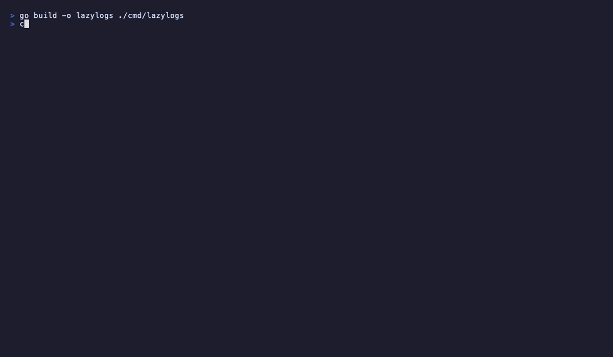

# lazylogs

A fast, interactive TUI viewer for structured logs. Think `less` meets `jq` -- for your terminal.

```
cat app.log | lazylogs
```



```
10:00:00.100 INF server starting                     version=1.2.0 port=8080
10:00:00.250 INF database connected                  host=db.internal latency=48ms
10:00:03.500 WRN slow query detected                 duration=1.2s table=orders
10:00:06.000 ERR failed to send email                error=SMTP connection timeout
10:00:07.000 ERR payment gateway error               gateway=stripe error=upstream timeout
10:00:15.000 FTL out of memory                       allocated=4.0GB limit=4.0GB
```

## Features

- **Auto-detect format** -- JSON Lines, logfmt, plain text. No configuration needed.
- **Color-coded levels** -- Errors in red, warnings in yellow, at a glance.
- **Filter by level** -- Press `1` to show only errors. Press `0` to reset.
- **Time range filter** -- Press `t` to filter by time: last 1m, 5m, 15m, 1h, or custom range.
- **Search** -- `/` to search across all fields.
- **Custom columns** -- `--columns time,level,msg,status,latency` for aligned table display.
- **Detail view** -- `Enter` to expand any entry, see all structured fields.
- **Follow mode** -- Auto-scroll to latest entries, like `tail -f`.
- **Fast** -- Batch processing handles 1M+ lines. ~550K JSON lines/sec on Apple M4.
- **Pipe-friendly** -- Works with `kubectl logs`, `docker logs`, `journalctl`, or any command.
- **Single binary** -- No runtime dependencies. Download and run.

## Install

```bash
go install github.com/syasoda/lazylogs/cmd/lazylogs@latest
```

### Build from source

```bash
git clone https://github.com/syasoda/lazylogs.git
cd lazylogs
go build -o lazylogs ./cmd/lazylogs
```

## Usage

```bash
# Read from file
lazylogs app.log

# Pipe from any command
cat app.log | lazylogs
kubectl logs -f my-pod | lazylogs
docker logs -f my-container 2>&1 | lazylogs
journalctl -f | lazylogs
stern my-app | lazylogs
```

### Column mode

Display specific fields as an aligned table:

```bash
lazylogs --columns time,level,msg,status,latency app.log

# Short form
lazylogs -c time,level,msg,method,path,status app.log
```

```
TIME          LEVEL MSG                       STATUS  LATENCY
10:00:02.120  INF   request completed         200     12ms
10:00:02.450  INF   request completed         200     8ms
10:00:03.100  INF   request completed         201     145ms
10:00:06.000  ERR   failed to send email
10:00:07.000  ERR   payment gateway error
```

### Time range filter

Press `t` in the TUI to filter by time:

| Key | Range |
|-----|-------|
| `1` | Last 1 minute |
| `2` | Last 5 minutes |
| `3` | Last 15 minutes |
| `4` | Last 1 hour |
| `5` | Custom range (e.g. `10:00-10:30`) |
| `0` | Reset |

## Supported Formats

lazylogs auto-detects the format of each line. You can mix formats in the same stream.

### JSON Lines

Works with any JSON logger -- [slog](https://pkg.go.dev/log/slog), [zap](https://github.com/uber-go/zap), [zerolog](https://github.com/rs/zerolog), [logrus](https://github.com/sirupsen/logrus), [Bunyan](https://github.com/trentm/node-bunyan), [Pino](https://github.com/pinojs/pino), etc.

```json
{"time":"2025-03-01T10:00:00Z","level":"info","msg":"request completed","status":200,"latency":"45ms"}
```

Auto-detected fields:
- **Level**: `level`, `lvl`, `severity`, `log_level`
- **Message**: `msg`, `message`, `text`, `body`
- **Timestamp**: `time`, `timestamp`, `ts`, `@timestamp`, `t`, `datetime`

### logfmt

```
ts=2025-03-01T10:00:00Z level=info msg="server started" port=8080
```

### Plain text

```
2025-03-01 10:00:08 ERROR failed to process payment
```

Level is detected from common keywords (`ERROR`, `WARN`, `INFO`, `DEBUG`, etc.).

## Key Bindings

| Key | Action |
|-----|--------|
| `j` / `k` / `Up` / `Down` | Scroll |
| `PgUp` / `PgDn` / `Ctrl+U` / `Ctrl+D` | Half-page scroll |
| `g` / `G` | Jump to top / bottom |
| `Enter` | Detail view (show all fields) |
| `/` | Search |
| `t` | Time range filter |
| `Esc` | Clear filter / back |
| `1` | Toggle error / fatal |
| `2` | Toggle warn |
| `3` | Toggle info |
| `4` | Toggle debug / trace |
| `0` | Show all levels |
| `f` | Toggle follow mode |
| `q` / `Ctrl+C` | Quit |

## Performance

Batch processing with incremental filtering. Handles large log files without re-scanning all entries on every update.

```
BenchmarkParseJSON     558K lines/sec    1689 B/op
BenchmarkParseLogfmt   2.9M lines/sec     480 B/op
BenchmarkParsePlain    3.4M lines/sec      96 B/op
```

## How It Works

```
                    ┌──────────────────────────────┐
stdin/file ──read──>│ parser (JSON/logfmt/plain)    │
                    └──────────┬───────────────────┘
                               │ chan (batched, up to 1000/16ms)
                    ┌──────────▼───────────────────┐
                    │ TUI model                     │
                    │  ├─ filter by level            │
                    │  ├─ filter by time range       │
                    │  ├─ filter by search           │
                    │  └─ incremental index update   │
                    └──────────┬───────────────────┘
                               │
                    ┌──────────▼───────────────────┐
                    │ view (list / columns / detail) │
                    └──────────────────────────────┘
```

## Recording a demo GIF

```bash
# Install vhs: https://github.com/charmbracelet/vhs
brew install vhs

# Record
vhs demo.tape
```

## Roadmap

- [x] Batch processing for large files
- [x] Time range filtering
- [x] Custom column display
- [ ] Tail mode for files (`lazylogs -f app.log`)
- [ ] Regex search
- [ ] Export filtered results to file
- [ ] Themes / color customization
- [ ] Windows support

## Contributing

Contributions are welcome! Please feel free to submit a Pull Request.

```bash
go test ./...
go build -o lazylogs ./cmd/lazylogs
./lazylogs testdata/demo.jsonl
```

## License

MIT License. See [LICENSE](LICENSE) for details.

## Acknowledgements

Built with the excellent [Charm](https://charm.sh) libraries:
[Bubble Tea](https://github.com/charmbracelet/bubbletea) |
[Lip Gloss](https://github.com/charmbracelet/lipgloss) |
[Bubbles](https://github.com/charmbracelet/bubbles)
